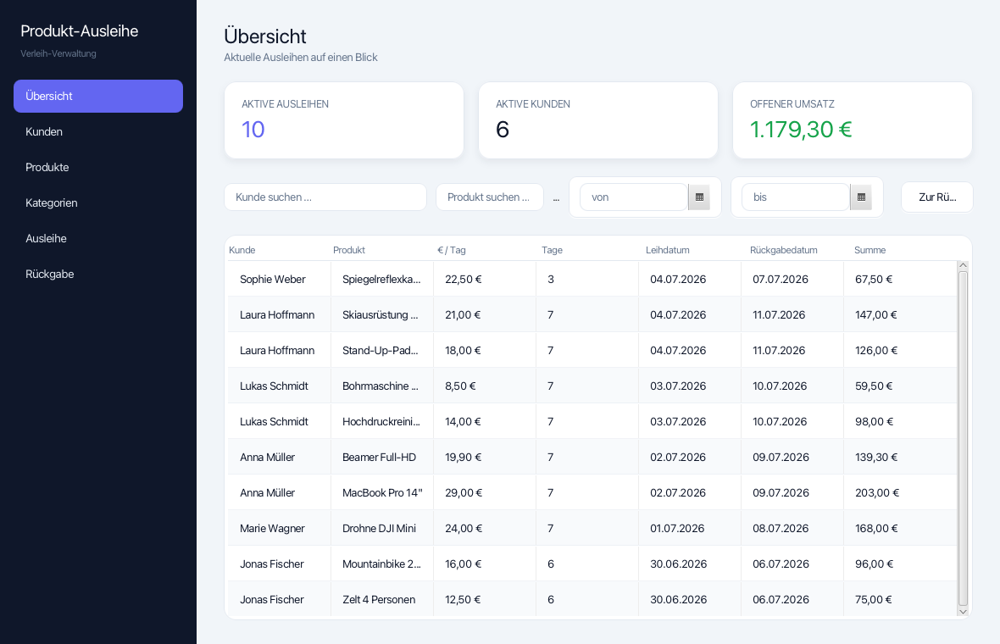
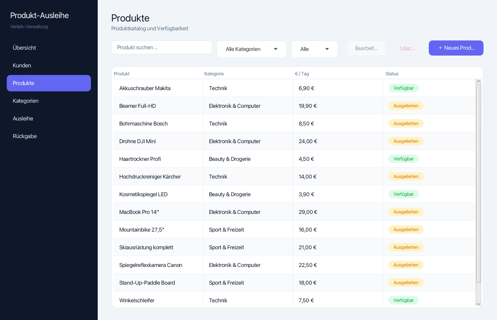
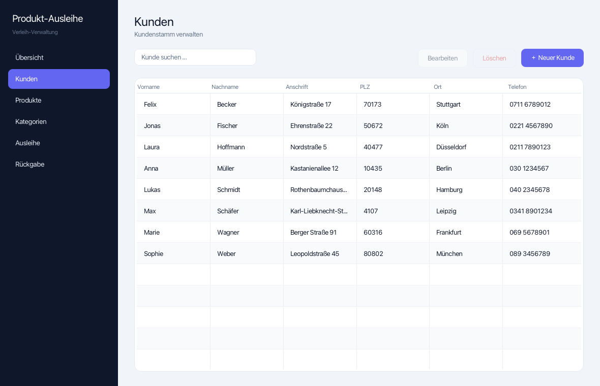

# Produkt-Ausleihe

A modern JavaFX desktop application for managing product rentals — customers, product
catalogue, categories, rentals, returns and invoicing — backed by a local SQLite database.

Originally a university project, it has been **re-architected into a clean, layered,
enterprise-style codebase** with a fresh visual design, a unit/integration test suite and
full documentation.

## Screenshots

### Dashboard — active rentals at a glance



### Products — catalogue with live availability



### Customers — searchable customer management



## Features

- **Dashboard** — KPI cards (active rentals, active customers, open revenue) and a
  filterable table of all active rentals (by customer, product and date range).
- **Customers, Products, Categories** — full CRUD via themed modal dialogs, with search
  and, for products, category/availability filters and live status pills.
- **New Rental** — pick a customer, add available products with rental periods, watch the
  total update live, then save and generate an invoice.
- **Returns** — select a customer with active rentals and return individual products.
- **Invoice** — a clean receipt summarising the rental and total.
- Local **SQLite** persistence, created automatically on first run.

## Tech stack

- Java 17, JavaFX 17
- SQLite (via `sqlite-jdbc`), accessed through hand-written JDBC repositories
- Maven
- JUnit 5 + Mockito for testing, JaCoCo for coverage

## Architecture

The application follows a layered architecture with dependencies pointing inward; the UI
depends only on services, and JDBC details never leak upward.

```
ui  ──▶  service  ──▶  persistence (repository interfaces)  ──▶  domain
                                    ▲
                          persistence.jdbc (SQLite implementations)

config.AppContext  = composition root that wires everything together
```

| Layer          | Responsibility                                                        |
| -------------- | --------------------------------------------------------------------- |
| `domain`       | Pure POJOs (`Customer`, `Product`, `Category`, `Rental`), the `RentalStatus` enum and exceptions. No JavaFX, no JDBC. |
| `persistence`  | Repository **interfaces**, `ConnectionFactory`, `SchemaInitializer`.  |
| `persistence.jdbc` | SQLite implementations using **prepared statements** throughout.  |
| `service`      | Business rules and input validation.                                  |
| `ui`           | JavaFX shell, views, dialogs and the `theme.css` design system.       |
| `config`       | `AppContext` — manual dependency injection (no framework).            |

See [`docs/ARCHITECTURE.md`](docs/ARCHITECTURE.md) for the full design, data model and the
rationale behind the key decisions.

For the portfolio story behind the modernization, see
[`docs/PORTFOLIO_CASE_STUDY.md`](docs/PORTFOLIO_CASE_STUDY.md).

### Notable improvements over the original

- **No SQL injection** — every query is parameterized (the original concatenated strings).
- **Separation of concerns** — UI, business logic and persistence are decoupled and each
  independently testable, replacing the original UI-reaches-into-a-global-DB design.
- **`BigDecimal` money** instead of `float`, and a `RentalStatus` enum instead of magic
  strings (persisted values are unchanged, so **existing databases still load**).
- **Automated tests** and a **modern, token-based UI theme**.

## Getting started

### Prerequisites

- JDK 17+
- Maven 3.8+

### Run

```bash
mvn javafx:run
```

The app creates a local `Laiheus.db` SQLite database in the project root on first start and
seeds the default categories. This runtime database is intentionally git-ignored.

### Load demo data (for screenshots / exploration)

To populate the database with realistic sample customers, products and active rentals:

```bash
mvn -q compile exec:java -Dexec.mainClass=com.ahmedsghaier.rental.devtools.SampleDataLoader
```

Then run `mvn javafx:run` to see a fully-populated dashboard. The loader is safe to keep
around: it does nothing if the database already has customers (pass `--force` to add the
demo data anyway). See
[`SampleDataLoader`](src/main/java/com/ahmedsghaier/rental/devtools/SampleDataLoader.java).

The screenshots above are regenerated (off-screen, via JavaFX `snapshot()`) with:

```bash
mvn -q javafx:run -DmainClass=com.ahmedsghaier.rental.devtools.ScreenshotTool
```

### Build

```bash
mvn clean package
```

### Test

```bash
mvn test
```

Runs the JUnit 5 suite (domain, service and repository integration tests). A coverage
report is written to `target/site/jacoco/index.html`.

## Project structure

```text
src/main/java/com/ahmedsghaier/rental/
  domain/            Domain model + RentalStatus enum + exceptions
  persistence/       Repository interfaces, ConnectionFactory, SchemaInitializer
  persistence/jdbc/  JDBC/SQLite repository implementations (prepared statements)
  service/           Application services with validation
  config/            AppContext composition root
  ui/                JavaFX shell, views, dialogs, components
src/main/resources/com/ahmedsghaier/rental/ui/theme.css   Design system
src/test/java/...    JUnit 5 + Mockito tests
```

## Portfolio context

This repository demonstrates layered application design, clean persistence with prepared
statements, dependency injection without a framework, a modern JavaFX UI, and a pragmatic
automated test strategy — grown out of an earlier university rental project.
